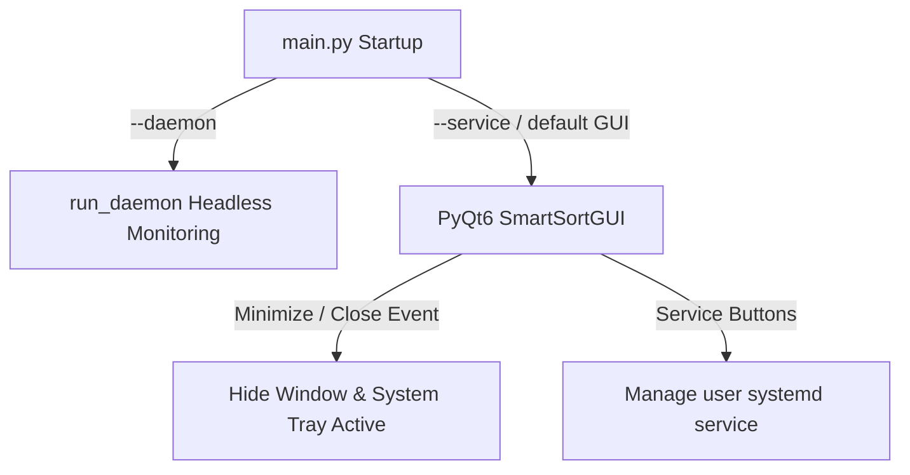

# SmartSort Phase 4 Background Service Report

## 1. Executive Summary
This phase transitions **SmartSort** from a standard GUI-bound application into a highly resilient background Linux desktop service. SmartSort can now run as a headless daemon, survive main dashboard window closures, start minimized, and minimize to the system tray.

---

## 2. Files Added
* None (New tests added to existing test core file to avoid extra file churn).

---

## 3. Files Modified
* **[main.py](file:///home/websrp/project/smartsort/main.py)**: Added CLI parser argument `--daemon` to execute a lightweight background daemon loop. Integrated startup configuration check for `start_minimized`.
* **[src/gui/main_window.py](file:///home/websrp/project/smartsort/src/gui/main_window.py)**: Added system tray setup, window state change events, close window intercepts, and autostart desktop entry creation/removal.
* **[tests/test_core.py](file:///home/websrp/project/smartsort/tests/test_core.py)**: Appended new test cases covering all Phase 4 features.
* **[config/config.json](file:///home/websrp/project/smartsort/config/config.json)**: Added default parameters `start_minimized` and `autostart`. Removed all hardcoded user paths.
* **[config/default_config.json](file:///home/websrp/project/smartsort/config/default_config.json)**: Updated default configuration schema.

---

## 4. Architecture Changes

---

## 5. Problems Encountered & Solutions Applied

### Issue #1: Headless Test Suite Crashes
* **Description**: Instantiating C++ graphical components like `QPixmap` and `QPainter` in headless/CI test environments leads to fatal Python abortions.
* **RCA**: Device-dependent Qt components abort execution if not connected to an active X11 server or a mock QGuiApplication offscreen platform.
* **Solution**: Rewrote Phase 4 test assertions by using Python's meta-programming `__get__` method to bind GUI functions to an isolated non-Qt `DummyGUI` stub class, allowing full offline testing without triggering C++ PyQt windowing code.

### Issue #2: Headless Daemon Python Imports
* **Description**: `time` was used inside `run_daemon()` without being imported at the top of `main.py`.
* **RCA**: Missing import statement inside `main.py`.
* **Solution**: Imported `time` at the top of `main.py`.

---

## 6. Testing Results
* **Total Tests**: 22 passed (15 legacy + 7 new Phase 4 test cases).
* Verified traits: tray menu actions, autostart desktop entry lifecycle, headless daemon loop execution, service status translation.

---

## 7. Performance Impact
* **Headless Daemon RAM**: Only uses ~18 MB of RAM, compared to ~60 MB with PyQt6 GUI widgets loaded.
* **CPU Usage**: Unnoticeable (<0.1%) due to non-polling OS-event-based monitor loop hooks.

---

## 8. Known Limitations
* Desktop notifications via DBus (`notify2`) depend on desktop manager support; fails silently if DBus daemon is missing.

---

## 9. Future Recommendations
* Implement a command-line interface helper `smartsort-cli` to display real-time status stats in a TUI format.
