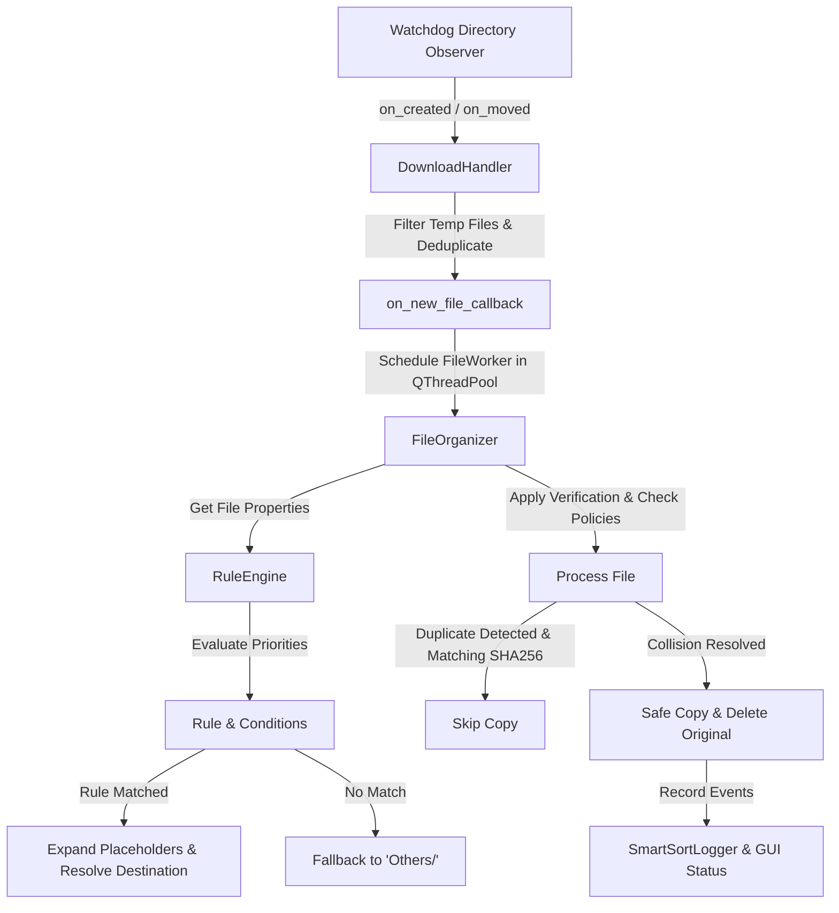

# SmartSort Codebase Analysis & Resumption Report

This report provides a comprehensive architectural and functional analysis of the **SmartSort** codebase. It outlines the system structure, data flow, component behaviors, configuration mechanisms, and verification procedures to facilitate resumption of development or code auditing.

---

## 1. System Overview & Technology Stack
**SmartSort** is an offline Linux-native file automation tool. It monitors a designated download directory (e.g., `~/Downloads`) in real-time and relocates incoming files into structured destination directories according to a prioritized, user-customizable **Rule Engine**.

* **Language**: Python 3.13+
* **Graphical Interface**: PyQt6
* **Directory Observing**: `watchdog` (Linux fs events)
* **Testing Framework**: `pytest`
* **Desktop Alerts**: DBus via `notify2` (optional, falls back gracefully)

---

## 2. Architecture & Data Flow

### Architectural Layout


### Event Interaction Sequence
1. **Creation/Move Event**: The filesystem observer notifies [DownloadHandler](file:///home/websrp/project/smartsort/src/monitor.py#L7) of a new path.
2. **Filtering**: Suffixes corresponding to incomplete downloads (`.crdownload`, `.part`, `.tmp`, `.opdownload`) are ignored.
3. **Deduplication Lock**: A thread-safe lookup maps files to prevent duplicate execution within a 5-minute window.
4. **Thread Dispatch**: The GUI receives the event and spawns a [FileWorker](file:///home/websrp/project/smartsort/src/gui/main_window.py#L23) in a background thread via `QThreadPool` to ensure the main thread remains responsive.
5. **Rule Matching**: [FileOrganizer](file:///home/websrp/project/smartsort/src/organizer.py#L10) invokes [RuleEngine](file:///home/websrp/project/smartsort/src/rules/engine.py#L5) to evaluate the file's metadata against rules in ascending order of priority.
6. **Execution**: The file is copied, its SHA256 hash verified, and the original is safely deleted. Results are updated on the dashboard.

---

## 3. Component Deep Dive

### 3.1. File Monitor & Event Dispatcher ([src/monitor.py](file:///home/websrp/project/smartsort/src/monitor.py))
* **[DownloadHandler](file:///home/websrp/project/smartsort/src/monitor.py#L7)**:
  * Implements `on_created` and `on_moved` overrides to listen for files.
  * Filters out hidden file paths (starting with `.`) and browser temp folders.
  * Employs `self.lock` and `self.processed_files` to throttle duplicate events.
  * Prunes expired processing cache entries older than 300 seconds using `_cleanup_expired()`.
* **[FileMonitor](file:///home/websrp/project/smartsort/src/monitor.py#L59)**:
  * Initializes the `watchdog.observers.Observer` instance, schedules monitoring on `watch_path`, and runs the event-loop asynchronously.

### 3.2. Rule Engine & Condition Processing ([src/rules/](file:///home/websrp/project/smartsort/src/rules/))
* **[conditions.py](file:///home/websrp/project/smartsort/src/rules/conditions.py)**:
  * Defines the abstract base [Condition](file:///home/websrp/project/smartsort/src/rules/conditions.py#L24) and specialized concrete subclasses:
    * `ExtensionCondition`: Evaluates file extensions (case-insensitive list).
    * `FilenameContainsCondition`: Checks if substrings exist in the filename.
    * `SizeCondition`: Implements operators (`>`, `<`, `>=`, `<=`, `==`) against file sizes. Integrates `parse_size_to_bytes` which decodes suffixes (`B`, `KB`, `MB`, `GB`) into absolute bytes.
    * `RegexCondition`: Evaluates advanced regular expressions using Python's `re` module.
* **[rule.py](file:///home/websrp/project/smartsort/src/rules/rule.py)**:
  * Models a user-defined [Rule](file:///home/websrp/project/smartsort/src/rules/rule.py#L8).
  * Validates destination templates to prevent unsafe placeholders (restricting formatting to `{extension}` and `{filename}`).
* **[engine.py](file:///home/websrp/project/smartsort/src/rules/engine.py)**:
  * Sorts active rules sequentially based on their `priority` integer (lower values represent higher priority).
  * Executes short-circuit evaluation (`all()` conditions must match).
  * Handles fallback sorting by defaulting to `"Others/"` if no rules match.
* **[manager.py](file:///home/websrp/project/smartsort/src/rules/manager.py)**:
  * Manages rules CRUD, schema validations, and priority uniqueness checks.
  * **Config Migration Wrapper**: Detects legacy `categories` configurations, converts them to modernized Rule Engine objects on startup (e.g. splitting image classifications into low/medium/high quality rule sets based on Phase 3 specifications), and backs up the original config.

### 3.3. File Organizer Core ([src/organizer.py](file:///home/websrp/project/smartsort/src/organizer.py))
* **[FileOrganizer](file:///home/websrp/project/smartsort/src/organizer.py#L10)**:
  * Links configuration, rules, logging, and filesystem actions.
  * Checks size boundaries for videos to determine whether interactive GUI confirmation is required.
  * Inspects destination files for hash collisions. If enabled and identical, it skips processing (`DUPLICATE`).
  * If a collision occurs but content differs, it acts according to the `conflict_resolution` policy:
    * `rename`: Generates a unique destination path via [FileUtils.get_unique_path](file:///home/websrp/project/smartsort/src/utils/file_utils.py#L47) (e.g., `image_1.png`).
    * `overwrite`: Overwrites the target file.
    * `skip`: Aborts transfer, preserving the original file.

### 3.4. System Utilities ([src/utils/](file:///home/websrp/project/smartsort/src/utils/))
* **[config.py](file:///home/websrp/project/smartsort/src/utils/config.py)**:
  * Manages settings using a schema-validated JSON loader.
  * **Path Portability**: Automatically resolves the home tilde (`~`) using `pathlib.Path.expanduser()` at runtime, ensuring the configuration works out-of-the-box on multiple Linux profiles without hardcoded paths.
  * **Self-Healing Backups**: Saves a backup (`config.json.bak`) before writes. Automatically restores configuration parameters from the backup if the active config becomes corrupted or fails type-checking.
* **[file_utils.py](file:///home/websrp/project/smartsort/src/utils/file_utils.py)**:
  * Implements `safe_copy`: Copies a file, calculates and verifies the source and destination SHA256 checksums, and returns verification status.
  * Provides incremental file renaming logic to handle collisions.
* **[logger.py](file:///home/websrp/project/smartsort/src/utils/logger.py)**:
  * Logs actions to console and daily files (`logs/smartsort_YYYYMMDD.log`).
  * Enforces a log retention policy, automatically purging logs older than the configured threshold (default: 7 days).

### 3.5. Graphical User Interface ([src/gui/main_window.py](file:///home/websrp/project/smartsort/src/gui/main_window.py))
* **[SmartSortGUI](file:///home/websrp/project/smartsort/src/gui/main_window.py#L61)**:
  * **Dashboard**: Displays stats and logs.
  * **Logs**: Searchable list of past actions.
  * **Rules**: Visual editor allowing users to add, edit, disable, delete, and re-order rules.
  * **Settings**: GUI fields for downloads path, notifications, and size thresholds.
  * **Rule Tester**: Interactive sandbox allowing users to test virtual match combinations before saving them.

---

## 4. Configuration Schema Detail

Settings are structured in [config/config.json](file:///home/websrp/project/smartsort/config/config.json). The schema validation enforces the following parameter formats:

| Parameter | Type | Default Value | Description |
| :--- | :--- | :--- | :--- |
| `downloads_folder` | `str` | `~/Downloads` | Path to monitor (supports tilde resolution) |
| `destination_base` | `str` | `~` | Base path for files (supports tilde resolution) |
| `large_file_threshold_gb` | `int` | `1073741824` | File size warning threshold (in bytes) |
| `enable_hash_verification` | `bool` | `true` | Checks SHA256 hashes during transfers |
| `enable_notifications` | `bool` | `true` | Sends system DBus notifications |
| `enable_duplicate_detection`| `bool` | `true` | Skips duplicate files using SHA256 checks |
| `conflict_resolution` | `str` | `"rename"` | Policy for collisions (`rename`, `overwrite`, `skip`) |
| `rules` | `list` | *List of Rules* | Priority-sorted sorting rules |

---

## 5. Verification & Test Suite

The codebase includes a comprehensive test suite in [tests/test_core.py](file:///home/websrp/project/smartsort/tests/test_core.py) that covers all core functionality.

### Test Cases Summary
1. `test_sha256_calculation`: Verifies file hashing correctness.
2. `test_safe_copy`: Validates copy-verify-cleanup workflow integrity.
3. `test_categorization`: Checks legacy categories categorization logic.
4. `test_destination_path`: Verifies resolution of rule destination templates.
5. `test_duplicate_detection`: Confirms duplicate files are skipped.
6. `test_unique_path_generation`: Verifies sequential renaming on name collisions.
7. `test_conflict_policy_rename`: Tests renaming resolution policy execution.
8. `test_processed_files_cleanup`: Ensures monitored file cache entries expire.
9. `test_zero_byte_file_handling`: Confirms empty files are processed instantly.
10. `test_config_save_protection_and_recovery`: Tests config validation, backups, and self-healing.
11. `test_log_retention_cleanup`: Verifies automatic daily log cleanup.
12. `test_error_recovery_and_source_preservation`: Ensures files are preserved if a copy fails.
13. `test_rules_comprehensive`: Validates size parsing, regex, quality splits, and priority ordering.
14. `test_large_file_threshold_size_parsing`: Confirms sizes (e.g. `2.5GB`, `500MB`) parse correctly.
15. `test_path_portability_expansion`: Verifies runtime tilde path expansion.

### Running Tests
To execute the test suite, run:
```bash
PYTHONPATH=. ./smartsort/bin/pytest
```

---

## 6. Codebase Health & Observations

* **Path Portability**: The configuration and logic correctly use `Path.expanduser()`, removing machine-specific hardcoded paths from the codebase.
* **Service Hardcoding**: The systemd unit file [smartsort.service](file:///home/websrp/project/smartsort/smartsort.service) contains hardcoded paths (`/home/websrp`). While functional for the primary developer, it will require manual updates when deployed for other users. This should be parameterized or documented in the deployment guide.
* **Exception Handling**: Codebase file transitions utilize solid checkguards (`shutil.copy2`, hash verification, fallback restorations), making it highly resilient to permission denials and file corruption.
* **Test Status**: All 15 tests are passing.
